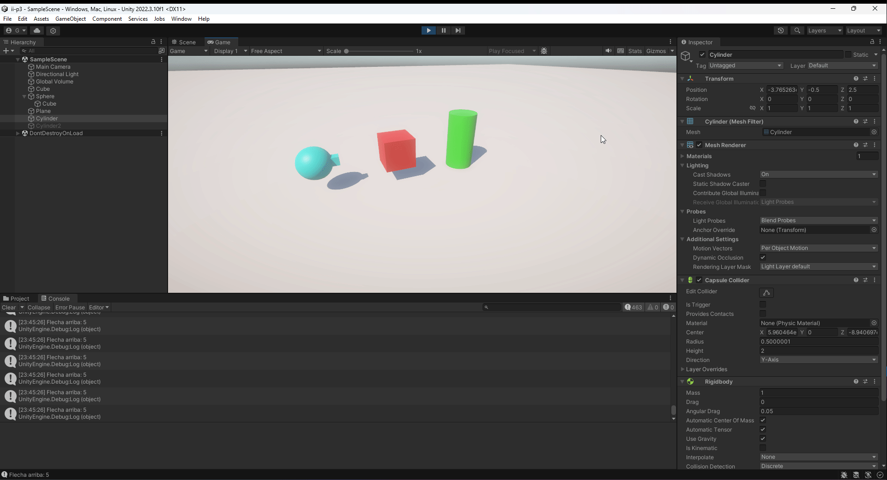
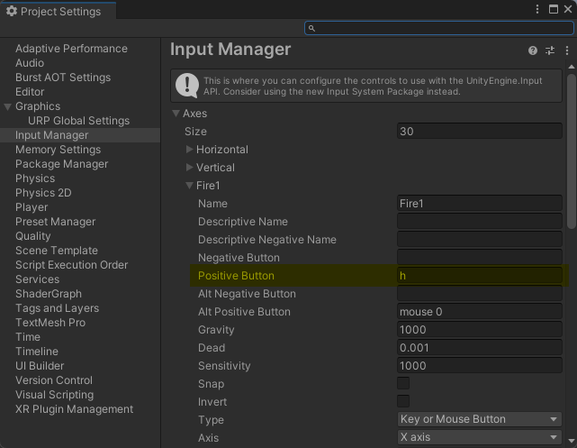
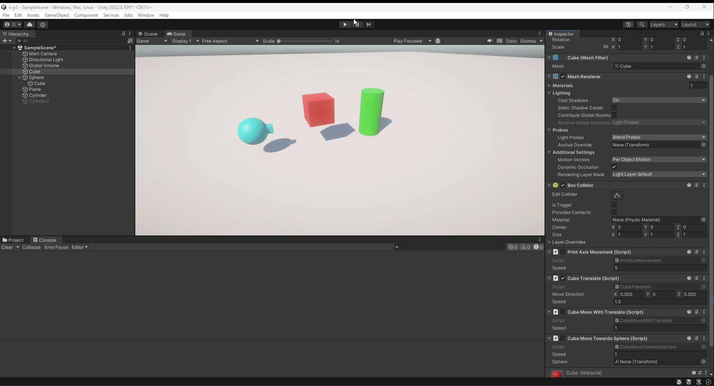
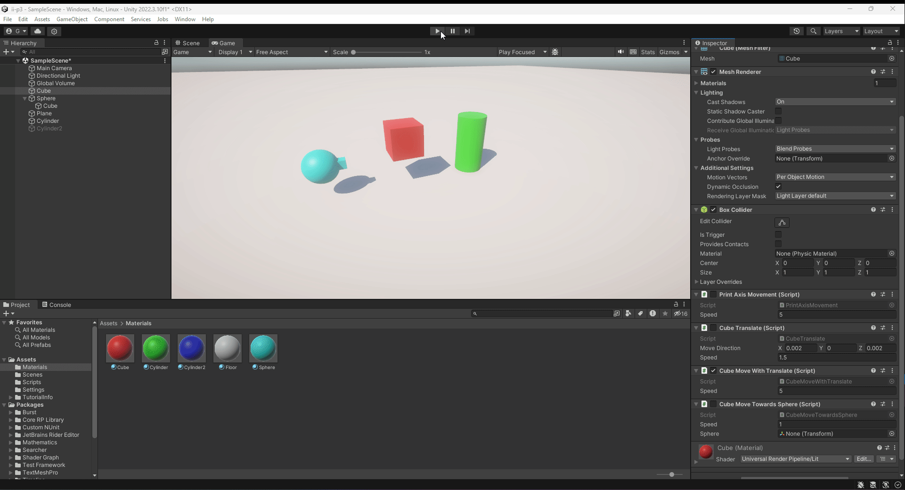
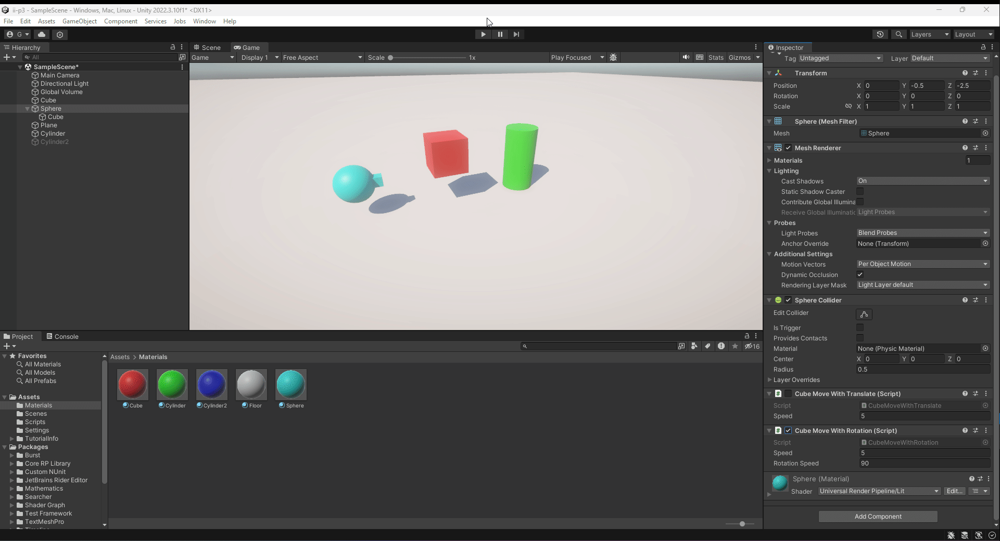
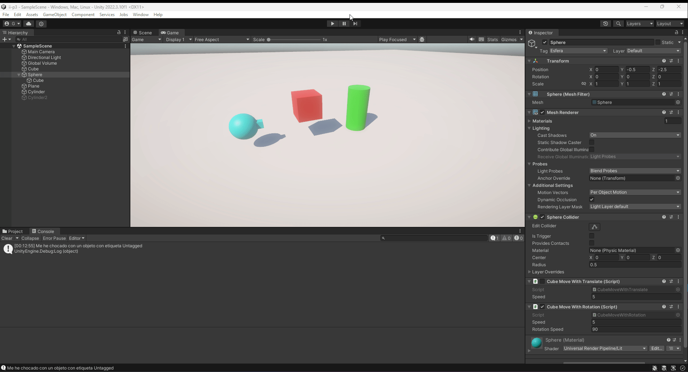
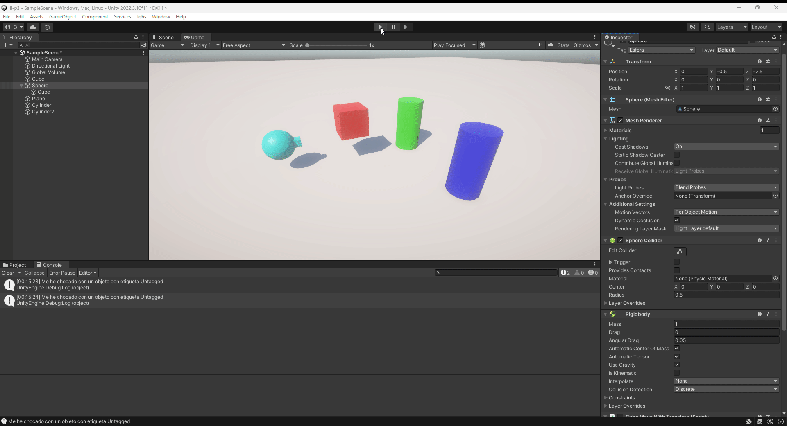

# Interfaces Inteligentes: Práctica 3
## Movimiento - Físicas
### Ginés Cruz Chávez
Práctica 3 de la asignatura Interfaces Inteligentes: Movimiento - Físicas

Para cada ejercicio, se mostrará su enunciado junto con un GIF que muestra el funcionamiento del ejercicio, además de un enlace al script de ese ejercicio.

### Ejercicio 1
* Agrega un campo velocidad al cubo de la práctica anterior y asígnale un valor que se pueda cambiar en el inspector de objetos. Muestra la consola el resultado de multiplicar la velocidad por el valor del eje vertical y por el valor del eje horizontal cada vez que se pulsan las teclas flecha arriba-abajo ó flecha izquierda-derecha. El mensaje debe comenzar por el nombre de la flecha pulsada.

[Script](scripts/PrintAxisMovement.cs)

### Ejercicio 2
* Mapea la tecla H a la función disparo.

### Ejercicio 3
* Crea un script asociado al cubo que en cada iteración traslade al cubo una cantidad proporcional un vector que indica la dirección del movimiento: moveDirection que debe poder modificarse en el inspector. La velocidad a la que se produce el movimiento también se especifica en el inspector, con la propiedad speed. Inicialmente la velocidad debe ser mayor que 1 y el cubo estar en una posición y=0. En el informe de la práctica comenta los resultados que obtienes en cada una de las siguientes situaciones:
    * Duplicas las coordenadas de la dirección del movimiento
        * La magnitud del vector se duplica y por lo tanto viaja al doble de velocidad.
    * Duplicas la velocidad manteniendo la dirección del movimiento
        * La magnitud del vector también se duplica y por lo tanto viaja al doble de velocidad.
    * La velocidad que usas es menor que 1
        * La magnitud del vector se acorta y por lo tanto, el cubo viaja a menor velocidad.
    * La posición del cubo tiene y>0
        * El cubo comienza a una altura mayor, pero se mueve de manera idéntica.
    * Intercambiar movimiento relativo al sistema de referencia local y el mundial.
        * En este caso, la rotación del cubo se mantiene constante por lo que el sistema de referencia no afecta a su movimiento.

[Script](scripts/CubeTranslate.cs)

### Ejercicio 4 y 5
* Mueve el cubo con las teclas de flecha arriba-abajo, izquierda-derecha a la velocidad speed. Cada uno de estos ejes implican desplazamientos en el eje vertical y horizontal respectivamente. Mueve la esfera con las teclas w-s (movimiento vertical) a-d (movimiento horizontal).
* Adapta el movimiento en el ejercicio 4 para que sea proporcional al tiempo transcurrido durante la generación del frame

[Script](scripts/CubeMoveWithTranslate.cs)

### Ejercicio 6 y 7
* Adapta el movimiento en el ejercicio 5 para que el cubo se mueva hacia la posición de la esfera. Debes considerar, que el avance no debe estar influenciado por cuánto de lejos o cerca estén los dos objetos.
* Adapta el movimiento en el ejercicio 6 de forma que el cubo gire hacia la esfera. Realiza pruebas cambiando la posición de la esfera mediante las teclas awsd

[Script](scripts/CubeMoveTowardsSphere.cs)

### Ejercicio 8
* Utilizar el eje “Horizontal” para girar el objetivo y que avance siempre en la dirección hacia adelante.

[Script](scripts/CubeMoveWithRotation.cs)

### Ejercicio 9, 10 y 11
* Configura el cilindro como un objeto físico, cuando el cubo o la esfera colisionen con él se debe mostrar un mensaje en consola con la etiqueta del objeto que haya colisionado.
* Configura el cubo como un objeto cinemático y la esfera como un objeto físico. Adapta los scripts del ejercicio 9 para obtener el mismo comportamiento.
* Configura el cilindro como un objeto de tipo Trigger. Adapta los scripts de los ejercicios anteriores para obtener el mismo comportamiento.

[Script](scripts/ShowNameOnCollision.cs)

### Ejercicio 12
* Agrega un cilindro de un color diferente al que ya hay en la escena y configúralo como un objeto físico. Selecciona un conjunto de teclas que te permitan controlar su movimiento por la escena y prográmale un movimiento que permita dirigirlo hacia la esfera. Prueba diferentes configuraciones de la esfera física con masa 10 veces mayor que el cilindro, física con masa 10 veces menor que el cilindro, cinemática y trigger. También prueba la configuración del cilindro de forma que su fricción se duplique o no. Explica en el informe todos los resultados posibles.
    * Esfera física con masa 10 veces mayor que el cilindro
        * Al cilindro le cuesta mover más la esfera, al ser más pesada.
    * Esfera física con masa 10 veces menor que el cilindro
        * El cilindro mueve con mayor facilidad la esfera, al ser más ligera.
    * Esfera física cinemática
        * La esfera no se mueve, el cilindro es incapaz de empujarla.
    * Esfera física trigger
        * El cilindro atraviesa la esfera, es incapaz de empujarla.
    * Cilindro con fricción duplicada
        * El cilindro se mueve con mayor lentitud, ya que hay mayor fricción con el aire.

[Script](scripts/CylinderMove.cs)
